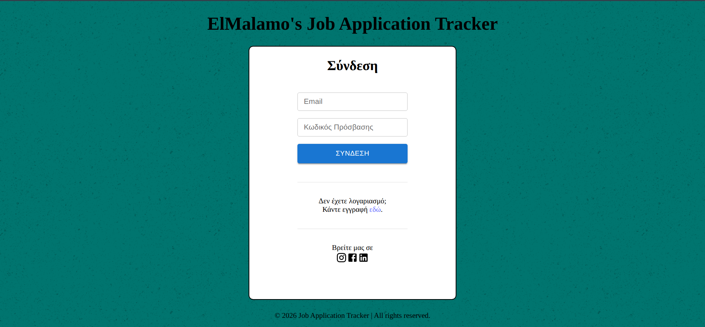
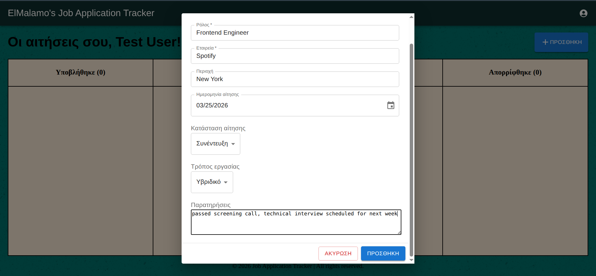
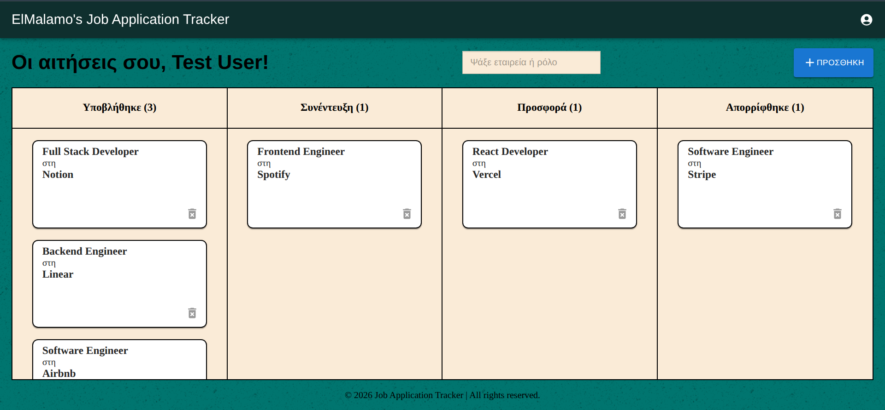

# Job-Application-Tracker

>  A full-stack web app to organize and track your job applications — so nothing falls through the cracks.

##  Features

- Add, edit, and delete job applications
- Track status per application: **Applied → Interview → Offer → Rejected**
- Log the date applied and any follow-up notes
- Dashboard summary of your application pipeline